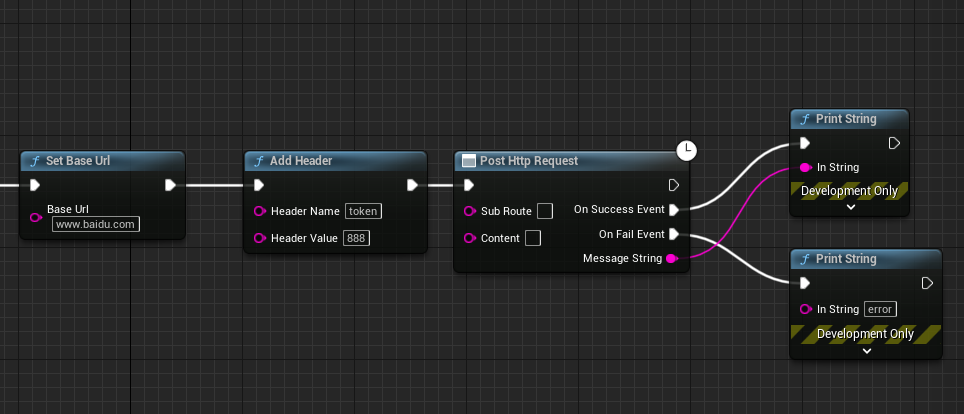

# InHttpClient
基于UE C++的http库封装的蓝图http库，只需要一个函数即可完成http的调用

# 使用方法
针对前后端分离架构，通过设置baseurl来设置服务器的ip地址，然后后续调用只需要设置subroute即可。  
注意：这个库只支持设置一个baseurl。
GetHttpRequest方法和PostHttpRequest方法可以多次调用。使用示例如下：

另外考虑到能够兼容不同baseurl地址的http请求，我们还设计了带有baseurl参数的http请求，同样一个函数搞定了所有。  
GetHttpRequestWithBaseUrl方法和PostHttpRequestWithBaseUrl方法可以多次调用。  

